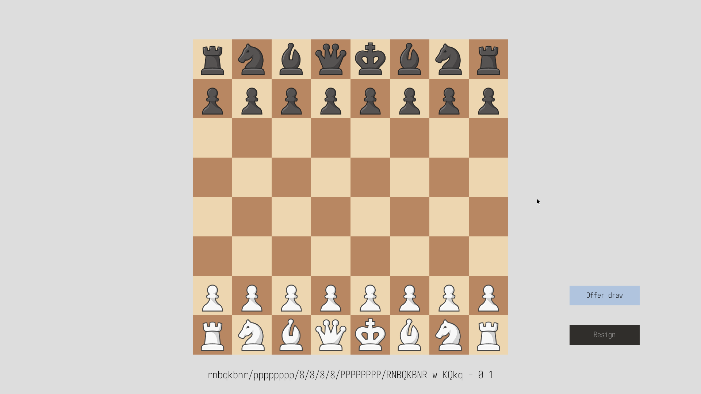

# Chess MVC

## Overview

This is a fully functioning MVC Chess GUI written in Java.
It leverages the <a href="https://processing.org">Processing</a> library for the graphical user interface,
<a href ="https://sojamo.de/libraries/controlP5/">ControlP5</a> for buttons, and
<a href="https://junit.org/junit5/">JUnit</a> for testing.

The chess logic is implemented using [bitboards](https://www.chessprogramming.org/Bitboards) with a little endian rank file mapping board representation.
All chess rules are implemented including castling king and queenside, en passant, pawn promotions and draw by 75 move rule.

All the techniques used to implement this chess game are documented in the [chess programming wiki](https://www.chessprogramming.org/Main_Page).

### Architecture

The code is structured as a monorepo with the following projects and dependencies.


## Screenshots


### New game



### Highlighted source square


### Legal moves per piece


### Error feedback


### Draw offers


### Castling


### Pawn promotions


### Resignations


### Checkmate


## Requirements

-   jdk 21
-   node
-   pnpm

## Getting started

### 1. Clone the repository

```sh
git clone https://github.com/clemenscodes/chess.git
cd chess
```

### 2. Install build dependencies

```sh
pnpm install
```

### 3. Start

```sh
pnpm start
```

### Alternative

Using an IDE like IntelliJ will also build and start the project without additional configuration.

## JShell e2e testing

To test the model using the jshell, simply run the jshell script:

```sh
pnpm jshell
```

or manually:

```sh
jshell --class-path dist/api:dist/model --startup e2e/model.jshell
```

## Javadoc

```sh
pnpm run docs
```
