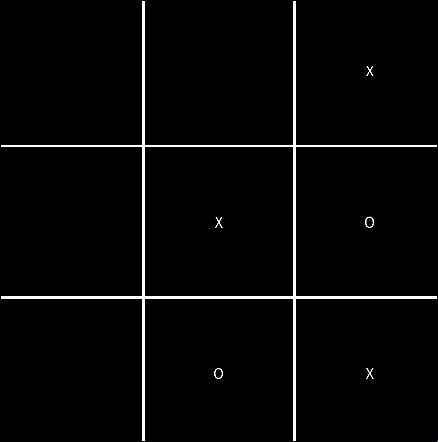
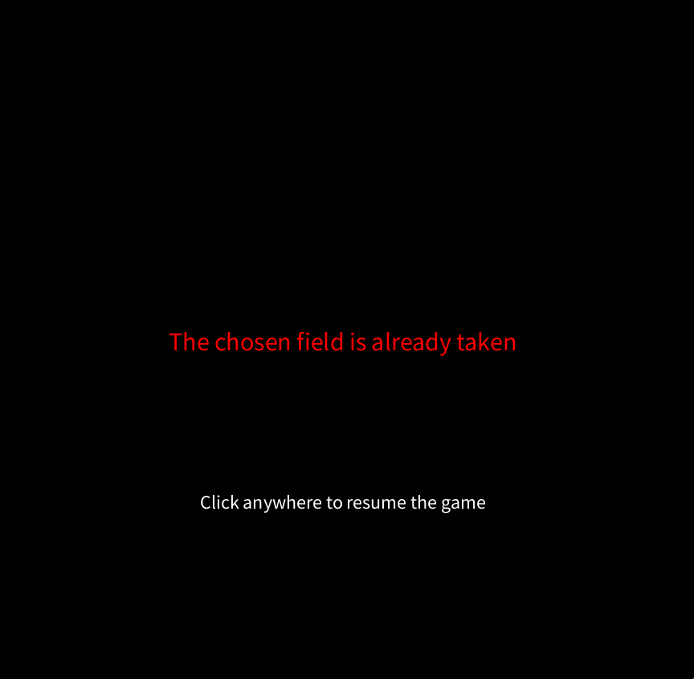
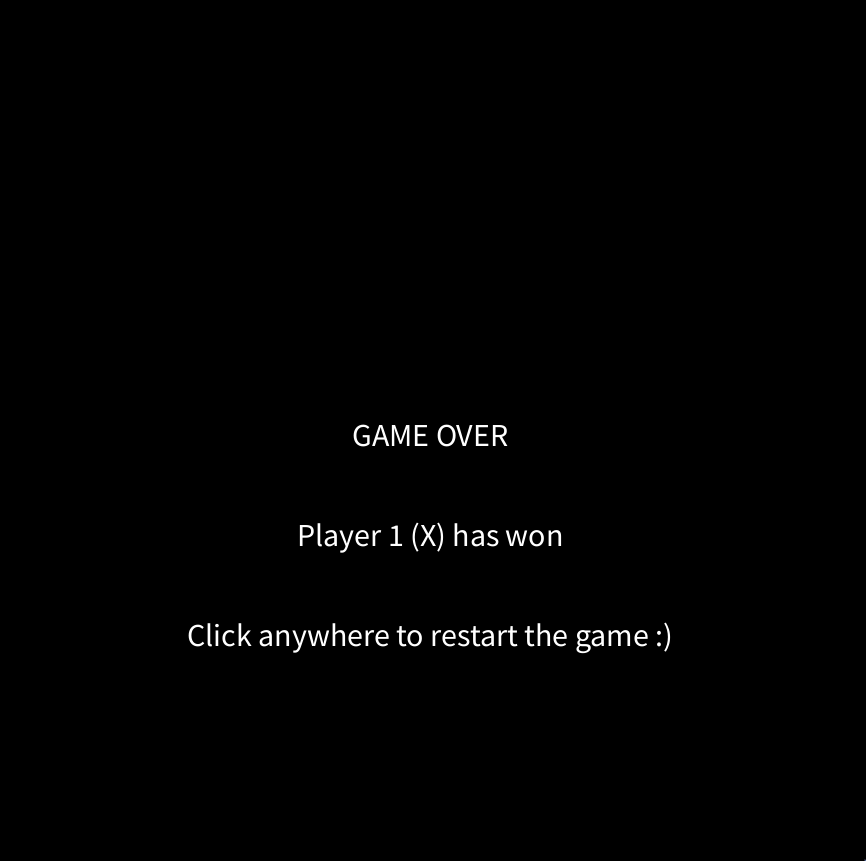

# TicTacToe

## Beschreibung

TicTacToe mit Java/Processing.

Eins gegen Eins, Kreuz gegen Kreis, Kreuz fängt an.

Abwechselnd wird ein Feld markiert,
wer zuerst drei Felder in einer Reihe markiert gewinnt.

## Screenshots






## Bibliotheken

-   [Processing](https://processing.org/)

## Starten

Im Terminal ausführen:

```shell
/etc/profiles/per-user/clay/bin/java \
 -javaagent:/nix/store/j7pv52m23cc0fib3f56irf5722s2x4y8-idea-ultimate-2023.2.3/idea-ultimate/lib/idea_rt.jar=34247:/nix/store/j7pv52m23cc0fib3f56irf5722s2x4y8-idea-ultimate-2023.2.3/idea-ultimate/bin \
 -Dfile.encoding=UTF-8 \
 -Dsun.stdout.encoding=UTF-8 \
 -Dsun.stderr.encoding=UTF-8 \
 -classpath /home/clay/.local/src/pis/dist/tictactoe:/home/clay/.local/src/pis/dist/libtictactoe:/home/clay/.m2/repository/thm/pis/processing/0.0.1/processing-0.0.1.jar \
 Dark
```

## JShell

```shell
jshell --class-path ./dist/libtictactoe/model
```

In jshell:

```jshell
import model.TicTacToeModel;
var model = new TicTacToeModel();
```

Mit `model` kann dann alles gemacht werden.
